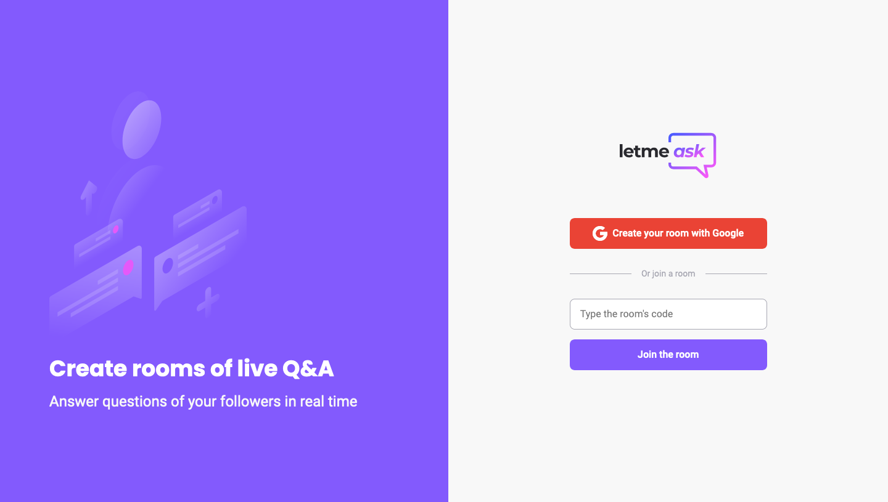
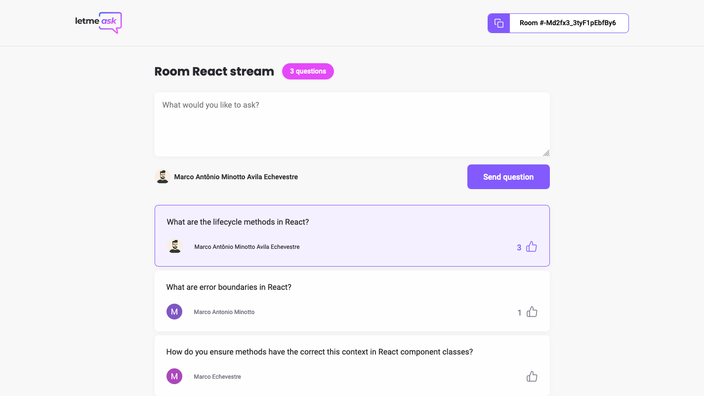

  

	
  
  
  
   
  
  

# 📖 About

Letmeask is a website of real time question and answer of your followers, focus in helping you to identify the best questions to answer during your streaming. It was developed according to the course "NWL Together", made by [RocketSeat](rocketseat.com.br)

# 📐 Layout

  

    
  

  

    
  
 

### 🚀 Tecnologies

- React.js
- Typescript
- SCSS
- HTML
- Firebase

# 🔧 How to run

- Download this project to your computer or use the git command `git clone git@github.com:marcoaminotto/letmeask.git`
- Open the folder letmeask in your system's shell
- Run `$ yarn install` to install the project's modules

### Webpage

- Open the folder letmeask in a terminal tab
- Run `$ yarn dev`

# :closed_book: License

Released in 2021 :closed_book: License

This project is under the [MIT license](./LICENSE).

Give a ⭐️ if this project helped you!

#

   <b> &#60;/&#62; by <a href="https://www.linkedin.com/in/marco-echevestre/">Marco Echevestre</a></b>

